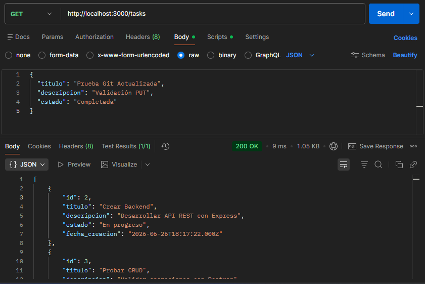
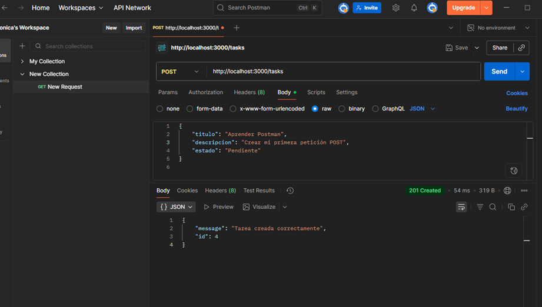
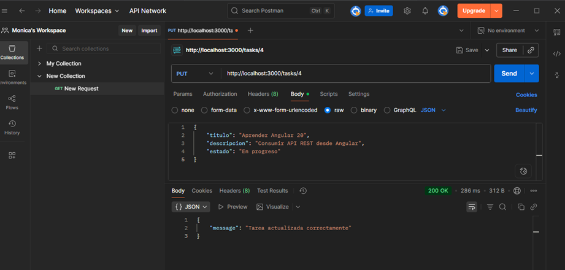
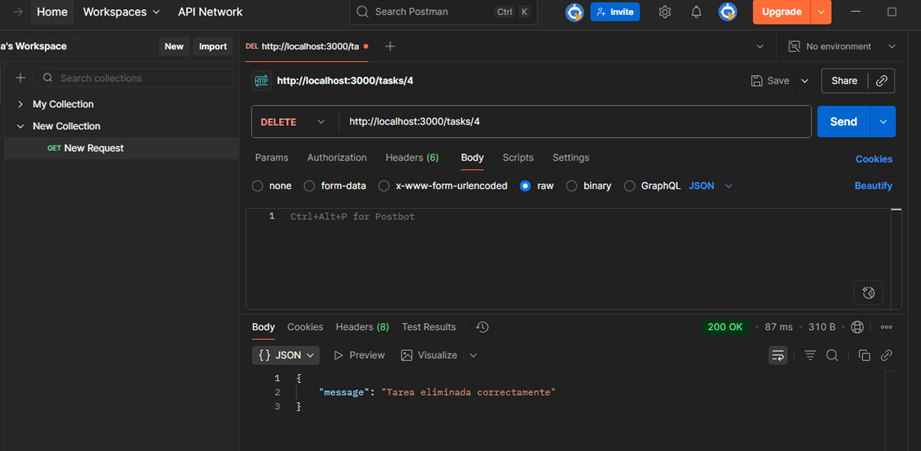

# 📦 Task Manager Backend

## 🚀 Descripción

Task Manager Backend es una API REST desarrollada con **Node.js**, **Express** y **MySQL** que permite gestionar tareas mediante operaciones CRUD (Crear, Consultar, Actualizar y Eliminar).

El proyecto fue desarrollado como parte de una prueba técnica Full Stack, siguiendo una arquitectura por capas para garantizar una adecuada separación de responsabilidades, facilitar el mantenimiento del código y permitir una futura escalabilidad.

---

# ✨ Características

* API REST desarrollada con Express.
* Arquitectura por capas.
* Integración con MySQL.
* CRUD de tareas.
* Consultas SQL parametrizadas.
* Manejo básico de errores.
* Variables de entorno mediante `.env`.
* Script SQL para la creación de la base de datos.
* Integración con un Frontend desarrollado en Angular 20.

---

# 🛠 Tecnologías utilizadas

* Node.js
* Express.js
* MySQL
* mysql2
* dotenv
* cors
* Git
* GitHub

---

# 📁 Arquitectura del proyecto

El backend sigue una arquitectura por capas, donde cada carpeta tiene una responsabilidad específica.

```text
backend/
│
├── config/
│   └── db.js
│
├── controllers/
│   └── taskController.js
│
├── models/
│   └── taskModel.js
│
├── routes/
│   └── taskRoutes.js
│
├── services/
│   └── taskService.js
│
├── .env.example
├── database.sql
├── package.json
└── server.js
```

### Descripción de la estructura

| Carpeta     | Responsabilidad                                      |
| ----------- | ---------------------------------------------------- |
| config      | Configuración de la conexión con MySQL.              |
| routes      | Definición de las rutas de la API.                   |
| controllers | Recepción de solicitudes HTTP y envío de respuestas. |
| services    | Lógica de negocio de la aplicación.                  |
| models      | Acceso y consultas a la base de datos.               |

---

# 🗄 Base de datos

La aplicación utiliza una base de datos MySQL llamada:

```sql
task_manager
```

La tabla principal es:

```text
tasks
```

Campos:

* id
* titulo
* descripcion
* estado
* fecha_creacion

El script para crear la base de datos se encuentra en:

```text
database.sql
```

---

# ⚙ Variables de entorno

Crear un archivo `.env` utilizando como referencia el archivo `.env.example`.

Ejemplo:

```env
DB_HOST=localhost
DB_USER=root
DB_PASSWORD=tu_password
DB_NAME=task_manager
PORT=3000
```

---

# 📥 Instalación

Clonar el repositorio:

```bash
git clone https://github.com/Monica3daza0307/task-manager-backend.git
```

Ingresar al proyecto:

```bash
cd task-manager-backend
```

Instalar dependencias:

```bash
npm install
```

Configurar las variables de entorno.

Importar el archivo `database.sql` en MySQL.

---

# ▶ Ejecutar el proyecto

Modo desarrollo:

```bash
npm start
```

La API estará disponible en:

```text
http://localhost:3000
```

---

# 📡 Endpoints

## Obtener todas las tareas

```http
GET /tasks
```

Obtiene el listado completo de tareas.

---

## Crear tarea

```http
POST /tasks
```

Ejemplo:

```json
{
  "titulo": "Estudiar Angular",
  "descripcion": "Repasar Angular Material",
  "estado": "Pendiente"
}
```

---

## Actualizar tarea

```http
PUT /tasks/:id
```

Actualiza una tarea existente.

---

## Eliminar tarea

```http
DELETE /tasks/:id
```

Elimina una tarea por su identificador.

---

# 🧪 Pruebas

La API fue validada utilizando **Postman**, verificando correctamente todas las operaciones CRUD y el manejo básico de errores.

---

# 📷 Capturas de pantalla

> capturas del funcionamiento del backend y de las pruebas realizadas en Postman.

## Método GET


## Método POST


## Método PUT


## Método DELETE


# 🎨 Frontend relacionado

El frontend desarrollado para este proyecto se encuentra disponible en:

**https://github.com/Monica3daza0307/task-manager-frontend**

---

# 👩‍💻 Autora

**Mónica Daza**

Proyecto desarrollado como parte de una prueba técnica Full Stack utilizando Node.js, Express, MySQL y Angular.
